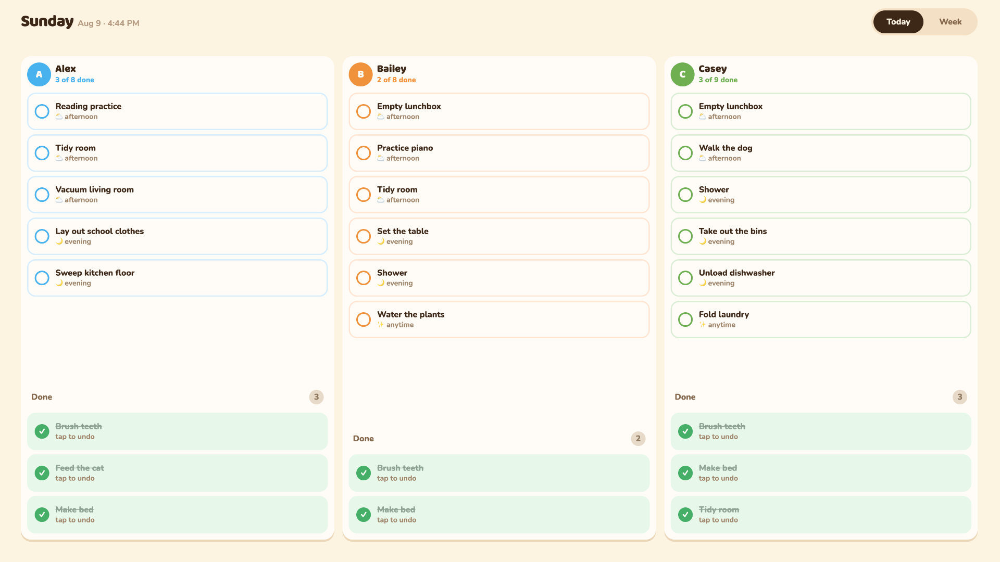
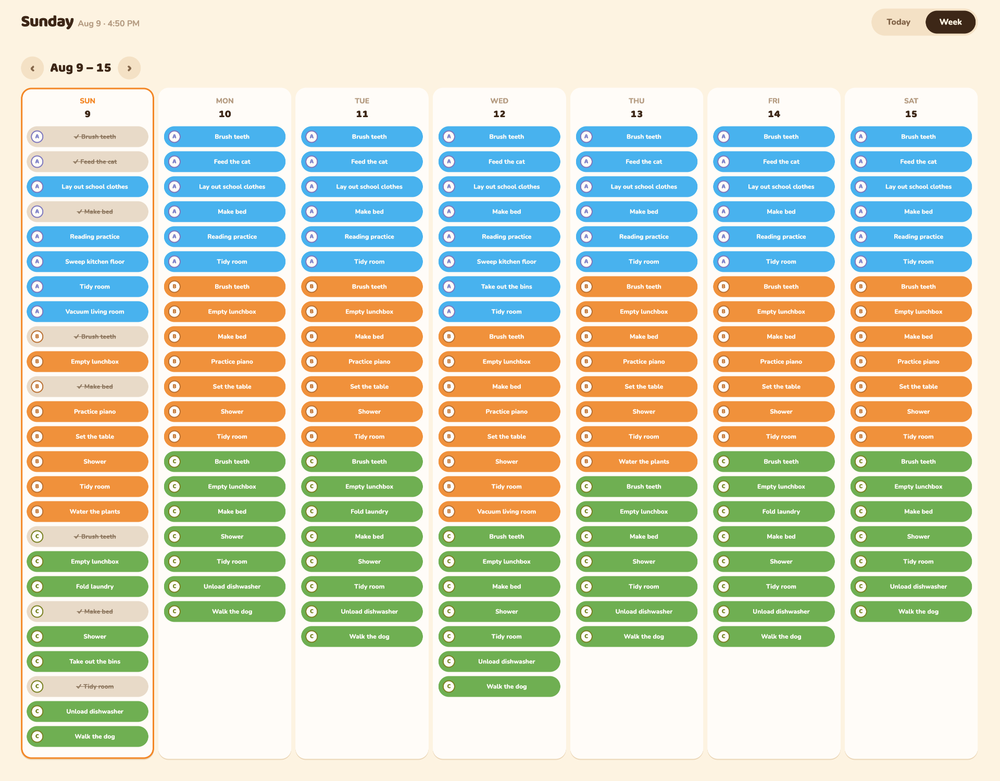
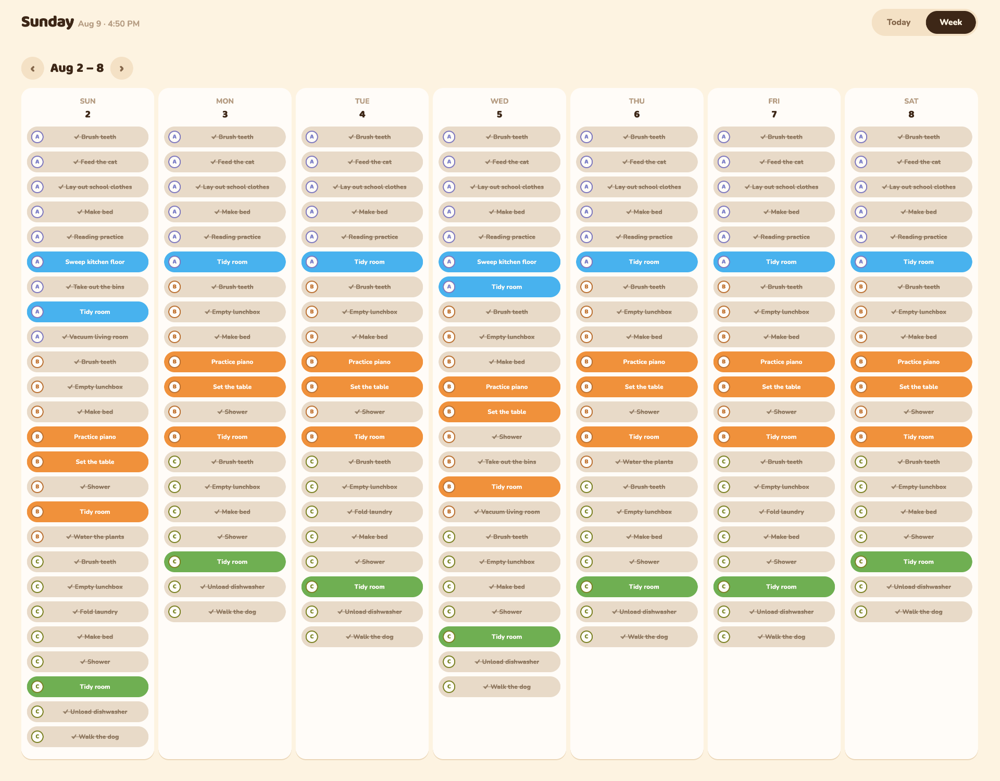
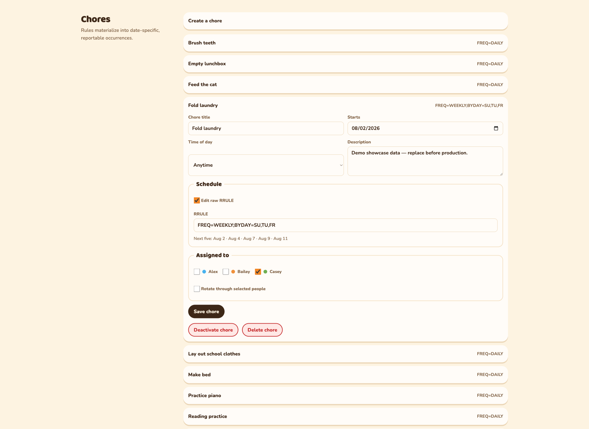

# ChoreBoard

ChoreBoard is a self-hosted family chore system designed to live on an always-on, wall-mounted iPad. It combines a playful, touch-first sticker board with recurring schedules, persistent check-offs, protected administration, reporting, and calendar feeds.



## Built for the family kiosk

This is not a desktop dashboard squeezed onto a tablet. The primary interface is built around the way children use a shared screen:

- **Large touch targets** make chores easy to tap without menus or tiny controls.
- **Immediate check-offs** update optimistically and are written to Postgres for durable history and reporting.
- **Optional tap confirmation** can require a second tap before a pending chore is completed.
- **Simple undo** lets a child tap a completed chore again to correct a mistake.
- **Today and Week views** keep the immediate task list focused while still showing the household schedule.
- **Color and initial badges** identify each assignee at a glance, including when multiple children share the same chore.
- **Completed states stay visible** so progress feels tangible instead of disappearing.

The Week view swaps the same board for the household's upcoming schedule, so a child can see what is coming without leaving the kiosk.



Paging back to a finished week shows the same board as a record: completed chores stay in place, checked off and struck through, and anything still outstanding keeps its color.



## Always-on iPad behavior

ChoreBoard ships as an installable Progressive Web App with Apple web-app metadata, standalone display mode, a landscape orientation, theme colors, and safe-area handling. When launched from the iPad home screen it opens without Safari's address bar or tabs and feels like a dedicated app.

The kiosk also looks after itself during long-running use:

- Refreshes board data every 30 seconds
- Retries automatically with backoff when the server or network is unavailable
- Shows an offline indicator when data becomes stale
- Resynchronizes whenever the iPad comes back online or the app becomes visible
- Rolls over to the new day without needing a reload
- Returns to the Today board after five minutes of inactivity
- Uses landscape layouts and iPad safe-area insets

iPadOS still controls whether the physical display sleeps. For a true always-on installation, set **Settings → Display & Brightness → Auto-Lock → Never**. Enable **Guided Access** if the tablet should remain locked inside ChoreBoard.

## Household admin

The kiosk itself has no editing controls, so a child cannot change the schedule. Everything is managed behind a password-protected admin page: people and their kiosk colors, recurring chore rules, one-off overrides, and recent completion totals.



Each chore carries an RFC 5545 recurrence rule. The editor previews the next five dates as the rule changes, assigns one or more people, and can rotate a shared chore through the selected group instead of repeating it for everyone.

## What is included

- Recurring chore schedules using RFC 5545 recurrence rules through `rrule`
- Multiple assignees or deterministic rotation through a selected group
- Date-specific occurrences that preserve historical completion records
- Protected people, chore, schedule, and occurrence administration
- One-off reassignment and skip controls without changing the recurring rule
- Safe chore deletion that preserves completed reporting history
- Completion reports grouped by person and chore
- Bearer-authenticated REST API
- Combined and per-person ICS calendar feeds
- Daily 60-day occurrence-materialization sidecar
- Docker Compose deployment with Postgres

## How it is built

| Layer | Technology |
| --- | --- |
| Application | Next.js 16, React 19, TypeScript |
| Interface | Responsive CSS, installable PWA, touch-first kiosk controls |
| Data | PostgreSQL and Prisma |
| Scheduling | RFC 5545 recurrence rules with `rrule` |
| Security | bcrypt admin login, signed sessions, bearer-authenticated API |
| Integration | JSON REST API and ICS calendar subscriptions |
| Deployment | Docker Compose with app, database, and materialization services |

## Local development

Copy `.env.example` to `.env`, replace every secret, then start Postgres:

```bash
docker compose up -d db
npx prisma migrate dev
npx tsx scripts/seed.ts
npm run dev
```

The demo seed is clearly prefixed with `Demo` and is never run automatically in production.

## Production

Create a protected `.env` containing the variables from `.env.example`, then:

```bash
docker compose up -d --build
docker compose ps
curl --fail http://127.0.0.1:3010/health
```

The app applies committed Prisma migrations before starting. The `cron` service calls the internal materialization endpoint every 24 hours.

`ADMIN_COOKIE_SECURE` must remain `false` for direct LAN HTTP access. Set it to `true` only after the app is served through an HTTPS reverse proxy.

## Install on an iPad

1. Open the ChoreBoard URL in Safari on the iPad.
2. Tap **Share**, then **Add to Home Screen**.
3. Launch ChoreBoard from its new home-screen icon.
4. Rotate the iPad to landscape.
5. Set Auto-Lock to Never and optionally start Guided Access.

The standalone home-screen app has its own browser storage and session context, so sign into the protected admin area from that instance if administration is needed on the tablet.

## Reporting

All `/api/*` routes require the API bearer token:

```bash
curl -H "Authorization: Bearer $API_TOKEN" \
  "http://localhost:3010/api/reports/completions?from=2026-08-01&to=2026-08-31"
```

The response includes `totalCompleted`, per-person totals, per-chore totals, and the underlying completion rows. The current bearer token authorizes both reads and writes, so keep it in protected secret storage rather than source control or agent instructions.

## Calendar feeds

- `/calendar/$FEED_TOKEN/all.ics`
- `/calendar/$FEED_TOKEN/person/$PERSON_ID.ics`

Calendar URLs use the secret feed token because calendar clients cannot send authorization headers.

## API surface

- `GET /api/occurrences?from=YYYY-MM-DD&to=YYYY-MM-DD&person=&status=`
- `POST /api/occurrences/:id/complete`
- `POST /api/occurrences/:id/uncomplete`
- `POST /api/occurrences/:id/skip`
- `GET|POST /api/chores`
- `GET|PATCH|DELETE /api/chores/:id`
- `GET|POST /api/people`
- `GET|PATCH|DELETE /api/people/:id`
- `GET /api/reports/completions?from=YYYY-MM-DD&to=YYYY-MM-DD&person=`
- `POST /api/internal/materialize?days=60`

## OpenClaw sync contract

OpenClaw should pull the next 14 days of pending occurrences and key Todoist tasks by occurrence `id`. A second run updates the existing task rather than creating another. Completed, skipped, or regenerated occurrences disappear from the pending pull and should close their corresponding Todoist task.

Todoist project/label mapping remains intentionally external because it depends on the household's final naming convention.
